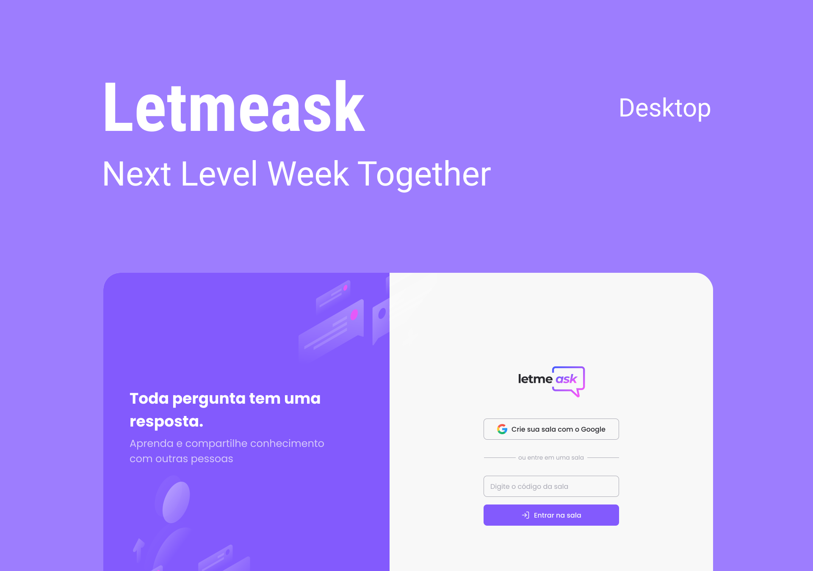

<!-- <h1 align="center">Project name</h1> -->

<p align="center">
  
</p>

<!-- Tags -->

<p align="center">
  
  
</p>

<!-- Menu -->

<p align="center">
  <a href="#-tecnologias">Tecnologias</a>&nbsp;&nbsp;&nbsp;|&nbsp;&nbsp;&nbsp;
  <a href="#-projeto">Projeto</a>&nbsp;&nbsp;&nbsp;|&nbsp;&nbsp;&nbsp;
  <a href="#-layout">Layout</a>&nbsp;&nbsp;&nbsp;|&nbsp;&nbsp;&nbsp;
  <a href="#-como-executar">Como executar</a>&nbsp;&nbsp;&nbsp;|&nbsp;&nbsp;&nbsp;
  <a href="#-licença">Licença</a>
</p>

<!-- Banner -->

<h1 align="center">
  
</h1>

<!-- Body -->

## ✨ Tecnologias

Esse projeto foi desenvolvido com as seguintes tecnologias:

- [React](https://reactjs.org)
- [Firebase](https://firebase.google.com/)
- [TypeScript](https://www.typescriptlang.org/)


## 💻 Projeto

Letmeask é perfeito para criadores de conteúdos poderem criar salas de Q&A com o seu público, de uma forma muito organizada e democrática.

Este é um projeto desenvolvido durante a **[Next Level Week Together](https://nextlevelweek.com/)**, apresentada dos dias 20 a 27 de Junho de 2021.

## 🔖 Layout

Você pode visualizar o layout do projeto através do link abaixo:

- [Layout Web](https://www.figma.com/community/file/1009824839797878169/Letmeask)

Lembrando que você precisa ter uma conta no Figma.

## 🚀 Como executar

Clone o projeto e acesse a pasta do mesmo.

```bash
$ git clone https://github.com/bumaruf/nlw-06-reactjs
$ cd nlw-06-reactjs
```

Para iniciá-lo, siga os passos abaixo:
```bash
# Instalar as dependências
$ yarn

# Iniciar o projeto
$ yarn start
```
O app estará disponível no seu browser pelo endereço http://localhost:3000.

Lembrando que será necessário criar uma conta no [Firebase](https://firebase.google.com/) e um projeto para disponibilizar um Realtime Database.

### ⚙️ Configuração

Não se esqueça de configurar o arquivo de variáveis ambiente para que o projeto funcione corretamente.

Duplique o arquivo `.env.example` alterando o nome para `.env` e depois preencha as variáveis necessárias.

## 📄 Licença

Esse projeto está sob a licença MIT. Leia o arquivo [LICENSE](LICENSE.md) para mais detalhes.

---

<!-- Footer -->
Desenvolvido por [Otávio Bumaruf](https://github.com/bumaruf).
